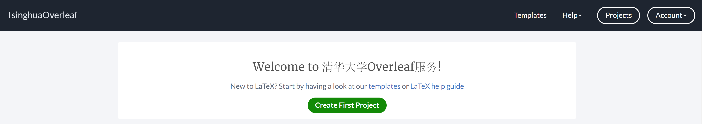

# THU-IIIF-Latex-Template
latex templates for tsinghua university iiif

清华大学产业创新与金融研究院latex文档模板

使用方法：注册和登录[Overleaf](https://overleaf.com)，推荐使用[Overleaf校内平台](https://overleaf.tsinghua.edu.cn/)，支持多人协作编辑文档

下载本项目作为zip文件，选择"Upload Project"，

然后将本项目的压缩包文件上传即可。上传完成后在左上角的**Menu（菜单）**中将**Compiler（编译器）**设置为**LuaLatex**，然后点击右边中间的**Recompile（重新编译）**按钮即可看到pdf文件。

其它使用说明请参考本项目编译出来的pdf文件和[这篇文章](https://lib.tsinghua.edu.cn/__local/C/B6/DD/EF041C3EC04D27DE5D30506A79B_9067CE0A_12FE64.pdf?e=.pdf)。

