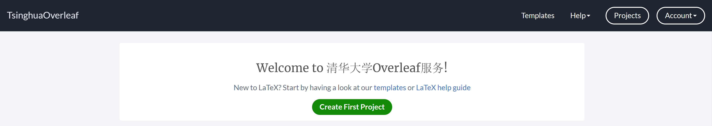

# THU-IIIF-Latex-Template
latex templates for tsinghua university iiif

清华大学产业创新与金融研究院latex文档模板

使用方法：注册和登录[Overleaf](https://overleaf.com)，推荐使用[Overleaf校内平台](https://overleaf.tsinghua.edu.cn/)，支持多人协作编辑文档

下载本项目作为zip文件，选择"Upload Project"，

然后将本项目的压缩包文件上传即可。其它使用说明请参考本项目编译出来的pdf文件和[这篇文章](https://lib.tsinghua.edu.cn/__local/C/B6/DD/EF041C3EC04D27DE5D30506A79B_9067CE0A_12FE64.pdf?e=.pdf)。

---

本分支为book版本，支持chapter，以下是已支持的部分特性

+ 加入Adobe系列字体，避免生僻字无法生成
+ 支持MacTex 2025本地XeLatex编译，因为参考文献使用了biber，所以要在`main.tex`首行加入`% !BIB TS-program = biber`，具体可参考[这里](https://tex.stackexchange.com/questions/501889/bibliography-using-biblatex-does-not-work-with-texshop)
+ 支持MacTex 2025本地LuaLatex编译，因为ctex的默认字体路径原因，需要按照[这里的issue](https://github.com/CTeX-org/ctex-kit/issues/722#issuecomment-2888518209)进行设置。
+ 加入水印命令

